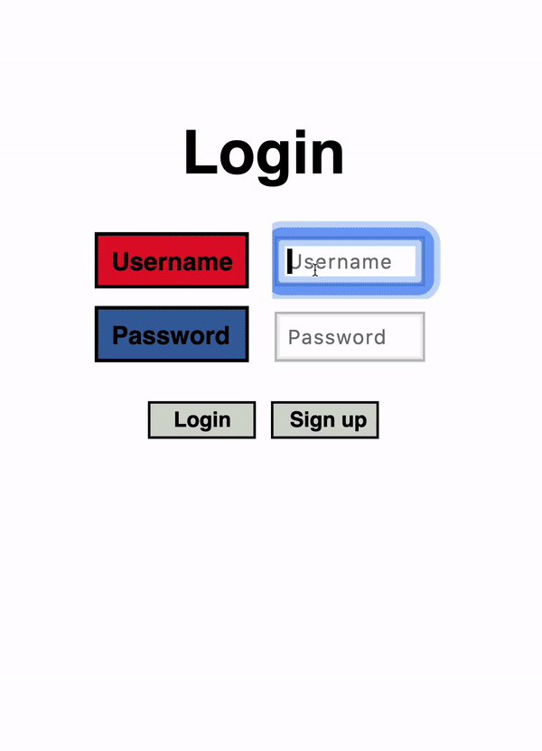

# Overview
**Name:** Jiwoo Lee  
**MacID:** leej229

**Last Update:** April 26, 2019  
**Status:** Finished Project03

# Descriptions: 
## **Crash!**
This project is a simple web game developed using **Elm** for the client side and **Django** for the server side. For more description about this project, please visit [here](https://mac1xa3.ca/Projects/Project03.pdf). 

The main objective of this game is your **reaction time**--how quickly you can think on the spot. The game involves two square-shaped characters on each side of the screen (left and right), moving towards each other at constant speed. Once two seconds have elapsed and the characters move out of the screen, they will be reset to their original starting postitions, which are the two edges of the screen. The size of the characters is randomized so that for every turn, one character is bigger than the other (there are only two predefined sizes: big and small). The objective is to **jump the big character over the small character** before they crash into one another (Hence the name: **Crash!**). The game is made so that it is impossible for the small character to jump over the big character; it must be the big character jumping over the small one.  

If the player successfuly jumps the big character over the small character, the two characters will not crash and successfully reach the end of the screen. When this happends, the player earns **1 point** and the characters get reset to their original position again with newly randomized sizes, and they start moving towards each other again. 

It's important to note that this game is **not a 2-player game**, and that **the player controls both characters**:  
* In order to jump the character on the left side, press **"o"**
* In order to jump the character on the right side, press **"p"**  

The two characters cannot jump simultaneously. 

When the two characters collide into each other, the game ends and updates user highscore. To play again, simply press the **"spacebar"**  
  
## **Tips**
This game was designed so that you place your **right hand**'s fingers on the following positions:
* Place your **middle finger** on **"o"** to jump character 1
* Place your **ring finger** on **"p"** to jump character 2
* Place you **thumb** on **"spacebar"** to start/restart the game  

Personally I found this the most comfortable/effective position of your fingers, but it's entirely upto the user on how they prefer to play the game.

### A Short Demonstration of the Game:


# Instructions on How to Run this Project
* ssh into the server with the following command:
    ```
    ssh leej229@mac1xa3.ca
    ```
* cd into **~/CS1XA3**, and activate the python virtual environment by typing the following command:
    ```
    source python_env/bin/activate
    ```
* cd into **~/CS1XA3/Project03**
* install the required python packages in **requirements.txt** located in **~/CS1XA3/Project03** by typing the following command:
    ```
    pip install -r requirements.txt
    ```
* cd into **~/CS1XA3/Project03/django_project**
* start the server with the follwing command:
    ```
    python manage.py runserver localhost:10034
    ```
* go to **https://mac1xa3.ca/u/leej229/project3.html** to see the project


# Features
## **1) User Authentication:**
### **1) Login:**
* When you go to **https://mac1xa3.ca/u/leej229/project3.html** page, the first thing you'll see is a Login page with two fields: **Username** and **Password**
* If you already have an account, fill out the Username and Password fields and click on the **Login** Button
* If the user is authenticated, the game screen will show up and you can begin to play!
* If the user is not authenticated, an error message will show up on the bottom of the screen to notify the user

### **2) Sign Up:**
* If you don't have an account already, click on the **Sign Up** button, and a sign up screen will show up 
* The sign up screen also has two fields: **Username** and **Password**
* Fill out the fields and click on **Sign Up** button to sign up
* You should not leave either of Username or Password empty
* You cannot sign up if the username already exists
* If either one of the above happens, an error message will show up on the bottom of the screen to notify the user
* If sign up succeeds, the user is authenticated, and the game screen will show up

When the user successfully login or sign up and is redirected to the game screen, a short instruction of the game is given on the screen and the user is to press on the **spacebar** to start the game.

### **3) Logout:**
* Users can log out of the game by clicking on the **"logout"** button located on the bottom-right side of the game device
* When logout is requested, the **server** correctly ends the user's session and logs out the user
* Once the user is logged out, he/she is brought back to the login screen
* Users cannot logout in the middle of the game

## **2) Points**
* A **Points** text is shown on the upper-centre of the game screen (underneath the **Crash!** title) to record/show the number of points the user earned in a game
* User earns a point each time he/she successfully jumps the big character over the small character and the characters reach the end of the screen (takes approximately 2 seconds to do so)
* Points gets resetted when the user presses the spacebar to start over the game
* On the **server side**, the total number of points the user earned througout the game (for every number of games played) is updayed in order to calculate the **average points** the user achieves per game

## **3) Number of Games Played**
* The number of games played increases by one each time the player starts/restarts the game
* On the **server side**, this number gets updated in the database in order to calculate the **average points** the user achieves per game

## **4) Average Points**
* The average points is calculated on the **server** by dividing the **total points** earned by the **number of games he/she played so far**
* Average points is calculated to 5 decimal points
* This information is automatically retrieved everytime the user logins to the game, or when the game end

## **5) Highscore** 
* Everytime the user achieves a highscore, this information gets posted to the **server**
* The server saves the user's highscore and updates the time this new highscore was made
* If the user's new highscore is within the top-5 of the users in the database, this information will get updated to the **leaderboard**
* The user's highscore is displayed on the lower-left side of the game device

## **6) Leader Board** 
* The leaderboard keeps track of the **top-5** highscorers
* If two users have the same highscores, the **server** decides the ordering of the leaderboard based on the updated time (whoever achieved this highscore first gets put on the top of the leaderboard)
* Users can access the leaderboard by clicking on the **"L"** button located on the buttom of the game device. When this button is pressed, the leaderboard with Username and Highscore is displayed on the screen 
* Leaderboard is retrieved from the server when the game first begins, when the game ends, and when the "L" button is pressed to display the leaderboard
* In order to go back to the game screen, press the **"B"** button located below the "L" button 
* The user can only display the leaderboard when the game first initializes, or when the game ends (you can't display the leaderboard in the middle of the game)

## **7) Themes**
### **1) Player Theme**
* There are 5 player themes to choose from 
* Users can navigate through and choose their favourite player theme by clicking on the **left or right** buttons located on the bottom-right side of the game device
* This information gets posted and saved on the **server** so that the users can retrieve their player theme settings when they login again at later times 

### **2) Device Theme**
* There also are 5 device themes to choose from 
* Users can navigate through and choose their favourite device theme by clicking on the **up or down** buttons located on the bottom-right side of the game device
* This information gets posted and saved on the **server** so that the users can retrieve their player theme settings when they login again at later times 


